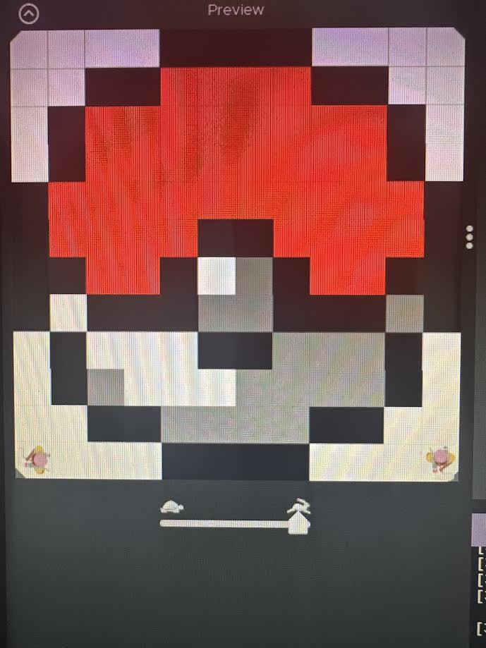

# Unit 1 - Asphalt Art

## Introduction

Cities use asphalt art to improve public safety, inspire their residents and visitors, and brighten communities. Your goal is to create asphalt art to revitalize The Neighborhood and bring the community together with the help of the Painter.

## Requirements

Use your knowledge of object-oriented programming, algorithms, the problem solving process, and decomposition strategies to create asphalt art:
- **Create a new subclass** – Create at least one new subclass of the PainterPlus class that is used for a component of the asphalt art design.
- **Plan an algorithm** – Use the problem solving process and decomposition strategies to plan an algorithm that incorporates a combination of sequencing, selection, and/or iteration.
- **Write a method** – Write at least one method in a PainterPlus subclass that contributes to a component of the asphalt art design.
- **Document your code** – Use comments to explain the purpose of the methods and code segments.

## Notes: Neighborhood & Painter Class

This project was created on Code.org's JavaLab platform using the built in Neightborhood GUI output. To test and edit this project you must build in Code.org's JavaLab with the Neighborhood GUI enabled. For reference to the Painter class documentation, [you can read more here.](https://studio.code.org/docs/ide/javalab/classes/Painter)

## Output:

## Reflection

1. Describe your project.

   - My project has a background painter that paints the entire background white
   - I have a pokeball painter that has two methods that were merged into one
   - The first method paints the entire top half and the second does the bottom half
   - The final method combines the two to paint the pokeball all at once

2. What are two things about your project that you are proud of?

   - One thing I am proud of about my project would be the design because I love pokemon
   - One other thing I am proud of about my project would be the amount of time it took me because I did it quicker than I thought I would be able to

3. Describe something you would improve or do differently if you had an opportunity to change something about your project.

   - If I had an opportunity to change something about my project, I would decompose it more/split up methods into tinier methods to make it easier to understand for readers